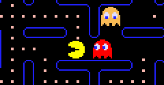

# PacMan

## Project Plan

Find the images.

https://www.spriters-resource.com/fullview/52631/

Find a way to cut/ extract the images.

This kind of images are called `spritesheets`.

There is an online cutter https://ezgif.com/sprite-cutter

Isn't there a way w/ code?

https://medium.com/dailyjs/how-to-build-a-simple-sprite-animation-in-javascript-b764644244aa

This looks like a more proper way and a reason not to use BlockLike...

Asked Ron if he thinks it makes sense to add the sprit sheet support to blocklike.

NEXT TIME

Animate only the PacMan.

Create and move the PacMan w/ the arrows.

Generate the dots.

Make the PacMan eat the dots.

## References

https://www.w3schools.com